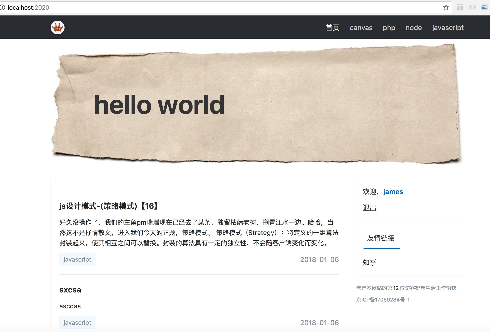
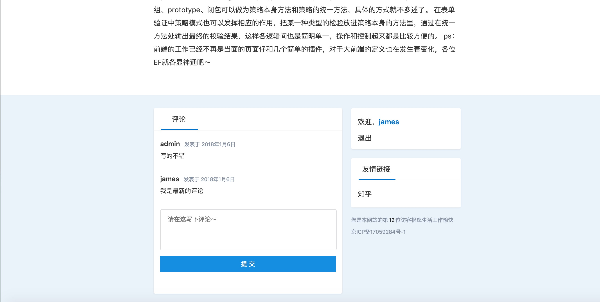
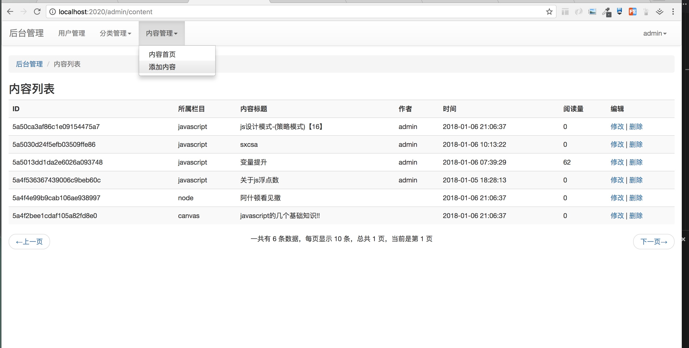

项目描述
===========================
这是一个基于node的博客，拥有博客基本的前后台功能，在static下有静态模版文件

****
## 启动方式
下载到本地后，cd到当前目录，安装package.json所需依赖包，然后启动入口文件
```javascript
node app.js
```

## 项目使用条件
- [x] nodejs环境
- [x] mongodb

## 页面所拥有功能如下
```
后台：
1.后台用户管理；
2.博客分类及增删改查；
3.博客文章及增删改查（文章内容支持markdown）；

前台：
1.导航；
2.文章及分页；
3.登录注册；
4.文章页；
5.评论功能

```

## 涉及技术
```
mongodb
swig模版
express

```

## 页面效果

* 首页


* 文章页


* 文章页评论


* 后台界面



## License
[MIT](/LICENSE)


```
windows：
1.cd到当前目录 npm install
2.app.js 运行
3.mongodb官网下载：www.mongodb.com
4.开启数据库（端口默认为27017）
    cd到mongodb安装目录下，如（D:\soft\MongoDB\Server\3.2\bin || C:\Program Files\MongoDB\Server\4.0\bin）
    开启：mongod --dbpath=D:\node-blog-master\db --port=27018 (dbpath为项目存储db的path / dport端口默认为27017)
        或者 mongo.exe (回车运行)
    下载连接管理工具（Robomongo 0.9.0-RC7）打开后 create  name:自定义名字 address:localhost port:27017
    查看mongoose.js用法：mongoosejs.com
5.打开网页：localhost:8080(app.js 中 app.listen(8080);)

C:\Program Files\MongoDB\Server\4.0\data\ 默认地址
控制面板-管理工具-服务 关闭MongoDB服务
```

by author tkw
2018.12.12